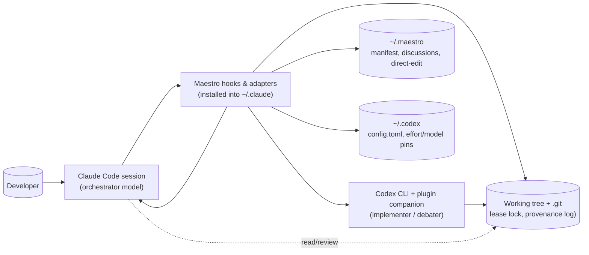
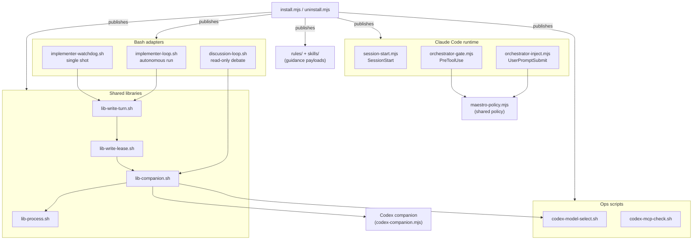

# Maestro — Architectural Design Document

**Version:** 1.0 (2026-08-11) — describes the repository as it stands on `main`
**Scope:** `hooks/`, `install.mjs`, `uninstall.mjs`, `rules/`, `skills/`, `tests/`, `.github/workflows/ci.yml`

Maestro turns one coding request inside Claude Code into a bounded autonomous
workflow: a conducting model (the orchestrator) plans, debates, and reviews while
a separate write-enabled model (Codex, run through the Codex plugin's companion
transport) executes and proves the work. This document describes the system's
architecture, components, data, interfaces, security, and operations.

---

## 1. Architectural Style

**Primary style: event-driven supervisor orchestration on a single host, with
file-system-based coordination that implements distributed-systems invariants
without a network.**

Maestro is not a microservice system, not a serverless application, and not a
traditional monolith. It is a set of *hooks and adapters* that attach to the
Claude Code runtime and supervise external agent processes. The system is best
understood as three stacked mechanisms:

1. **Event-driven triggering.** Claude Code fires lifecycle events
   (`SessionStart`, `UserPromptSubmit`, `PreToolUse`). Node hooks respond to
   those events: they inject guidance, maintain authorization state, and block
   forbidden actions. Everything starts from a hook event or a user-invoked
   CLI adapter.
2. **Supervisor loops.** Bash adapters (`implementer-loop.sh`,
   `implementer-watchdog.sh`, `discussion-loop.sh`) launch Codex jobs in the
   background, poll them, enforce deadlines, cancel on hang, and classify
   outcomes into a small set of terminal states.
3. **File-based coordination.** Because several processes — the orchestrator
   session, a loop, a watchdog, a verifier, the user's other sessions — can
   concurrently touch one working tree, Maestro implements *mutual exclusion,
   leases, generation fencing, and single-copy fail-closed checks* using
   directories, metadata files, atomic renames, and process identity. The
   concurrency problem is real distributed-systems territory; the substrate is
   deliberately a single local filesystem.

**Why this style fits the requirements**

| Requirement | Why this style |
|---|---|
| Two models must never both write the tree | A write Lease interval with generation tokens (fencing) gives exclusive write authority — the same guarantee a distributed lock provides, with no server |
| A background Codex job cannot ask questions interactively | Bounded supervisor loops with structured stop channels (`RESULT:`/`QUESTIONS:`) replace interactive chat |
| Work must not run forever | Deadlines, idle timers, iteration caps, and process-group termination bound every run |
| The orchestrator must not write source | A `PreToolUse` gate blocks direct `Edit/Write/MultiEdit`; enforcement is hook-event-driven |
| Nothing is believed on a model's word | Verification is a local transaction run by the supervisor after every completion claim |
| Zero external infrastructure | All state is files under `~/.claude`, `~/.maestro`, `~/.codex`, and the repository's Git dir — no database, no message bus, no cloud |

The most distinctive property of this architecture is that it deliberately
**serializes writers** (one Lease interval per Implementation run) instead of
scaling them. The unit of scale is not throughput but *safety*: the design
optimizes for "never two writers in one tree" and "every terminal state is
machine-readable", not for parallelism.

---

## 2. Core Components

```
┌────────────────────────────────────────────────────────────────────────┐
│                        Claude Code runtime                              │
│  (the conducting session — orchestrator model: Opus 5 / Fable 5)        │
└───┬──────────────────┬──────────────────┬───────────────────┬───────────┘
    │ SessionStart     │ UserPromptSubmit │ PreToolUse        │ Bash tool
    ▼                  ▼                  ▼                   ▼
┌──────────────┐  ┌──────────────────┐  ┌──────────────┐  ┌──────────────────┐
│session-start │  │orchestrator-     │  │orchestrator- │  │ implementer-loop │
│    .mjs      │  │inject.mjs        │  │gate.mjs      │  │ watchdog /      │
│ (session id, │  │ (directive +     │  │ (edit gate)  │  │ discussion-loop │
│  model pin)  │  │  direct-edit     │  │              │  │  (adapters)     │
└──────────────┘  │  flag)           │  └──────┬───────┘  └────────┬─────────┘
                  └────────┬─────────┘         │                     │ source
                           │                   │ maestro-policy.mjs  │
                           ▼                   ▼                     ▼
                    ┌──────────────────────────────────────────────────────┐
                    │         Shared Bash libraries (sourced modules)      │
                    │  lib-process.sh → lib-companion.sh → lib-write-      │
                    │  lease.sh → lib-write-turn.sh                        │
                    └──────────────────────────┬───────────────────────────┘
                                               │ transport (task/status/cancel/result)
                                               ▼
                    ┌──────────────────────────────────────────────────────┐
                    │   Codex CLI + openai-codex plugin companion          │
                    │   (codex-companion.mjs — background task broker)     │
                    └──────────────────────────────────────────────────────┘
```

### 2.1 Node hooks (event-driven surface, installed under `~/.claude/hooks`)

| Component | Trigger | Responsibility | Depends on |
|---|---|---|---|
| `session-start.mjs` | `SessionStart` | Reads the Codex model/effort pin; emits the setup question (when armed via `~/.maestro/ask-on-start`); appends a validated `MAESTRO_SESSION_ID` export to `$CLAUDE_ENV_FILE` for session attribution | `~/.codex/config.toml`, `~/.codex/maestro-impl-effort`, `~/.codex/maestro-impl-model` |
| `orchestrator-inject.mjs` | `UserPromptSubmit` | Resets the direct-edit authorization flag on new tasks; sets it only on an explicit "edit it yourself"-class imperative; emits the orchestrator/implementer directive only when the prompt carries a code/design signal; intercepts "codex model" setup phrasing | `maestro-policy.mjs`, `~/.maestro/direct-edit/` |
| `orchestrator-gate.mjs` | `PreToolUse` (`Edit\|Write\|MultiEdit`) | Blocks the orchestrator's direct source edits; allows non-code allowlisted files, anchored scratch/Desktop paths, any path carrying a `.claude` or `.codex` segment (harness exemption — segment-based, not root-anchored), and only a session-scoped, owner-private, exact-content direct-edit flag; refuses overrides inside subagents; fails closed on unreadable payloads | `maestro-policy.mjs`, `~/.maestro/direct-edit/` |
| `maestro-policy.mjs` | (shared module) | Single source of truth for file classification (non-code extensions/basenames), session-id validation, and direct-edit directive parsing with negation/quote guards | none |

### 2.2 Implementation adapters (Bash, the only implementation entry points)

| Component | Role | Key behavior |
|---|---|---|
| `implementer-loop.sh` | Autonomous Implementation run adapter (default dispatch path) | Acquires one Lease interval; loops up to `--max-iters` (default 4): build dispatch prompt → run one Write turn → classify `RESULT:` → on `DONE`, run a local Verification transaction (`--verify`) → feed actual failure output into the next dispatch. Exits only `VERIFIED_DONE` (0), `NEEDS_ANSWERS` (10), `BLOCKED` (11), `STUCK` (12), or `FAILED` (3/4), plus `INTERRUPTED` (4) on HUP/INT/TERM. Also owns `--clear-lease` operator recovery (`CLEARED` 0). |
| `implementer-watchdog.sh` | Peer single-shot Write turn adapter | One plan, one Write turn, one Lease interval; emits `MAESTRO_FINAL: WATCHDOG <STATE> rc=<n>`; cancellation maps to `POISONED` rc 125. |

### 2.3 Discussion adapter (read-only)

| Component | Role | Key behavior |
|---|---|---|
| `discussion-loop.sh` | Bidirectional design debate with Codex | `--new "<topic>"` starts a private transcript; `--turn <file>` appends the orchestrator's position and dispatches a read-only Codex reply (max 6 turns, configurable retries). Codex must open with a `STANCE:` line and may end `CONVERGED:` or `ESCALATE:`. Sidecar `.state` file tracks turns and supports orphan rollback; transcript lock with token-conditioned stale recovery. |

### 2.4 Shared Bash libraries (sourced modules — the layered core)

| Module | Owns | Interface |
|---|---|---|
| `lib-process.sh` | Bounded process-group supervision | `process_run_bounded TIMEOUT LABEL TICK STDOUT STDERR -- CMD…` (TERM grace → KILL), `process_interrupt`, `progress` channel on fd 3 |
| `lib-companion.sh` | Codex companion transport, explicit read/write mode | `companion_turn MODE PROMPT MAX_IDLE POLL RESULT PROFILE EVIDENCE LIFECYCLE`, `companion_interrupt`, `companion_writers`, companion discovery (`companion_resolve` picks the newest cached plugin), pin loading, launch, poll (`companion_poll`), cancellation, result fetch |
| `lib-write-lease.sh` | One run-scoped Lease interval: ownership, heartbeat, poisoning, provenance digest, release, operator recovery | `write_lease_begin`, `write_lease_end`, `write_lease_clear`, `_write_lease_turn_event`, repository digest (`repo_digest`/`repo_digest_bounded`), provenance log append/check |
| `lib-write-turn.sh` | One complete Write turn (shared by both adapters) | `write_turn_run PLAN MAX_IDLE POLL RESULT EVIDENCE`, `write_turn_interrupt`, the appended IMPLEMENTER CONTRACT |

Layering is strict and directional: `lib-process.sh` → `lib-companion.sh` →
`lib-write-lease.sh` → `lib-write-turn.sh`; adapters source only the top module
(`lib-write-turn.sh` for write adapters, `lib-companion.sh` for discussion).

### 2.5 Configuration and operations scripts

| Component | Role |
|---|---|
| `codex-model-select.sh` | Transactionally pins Codex model + debate effort (in `~/.codex/config.toml`) and implementation effort/model (in `~/.codex/maestro-impl-effort` and `~/.codex/maestro-impl-model`); serialized by its own lock; `--show`, `--pin`, `--ask-on-start on\|off` |
| `codex-mcp-check.sh` | Reports which MCP servers background Codex jobs inherit from `~/.codex/config.toml`, env keys masked |

### 2.6 Installer / uninstaller (package entry points)

| Component | Role |
|---|---|
| `install.mjs` | Validates first (options, settings schema, ownership manifest, symlinks), then atomically publishes managed hooks/rules/skills, merges exact-marked hook registrations into `~/.claude/settings.json`, appends `web_search = "disabled"` to `~/.codex/config.toml`, writes the sha256 ownership manifest; rolls back all published paths on ordinary late failure |
| `uninstall.mjs` | Removes only files whose bytes still equal the manifest's managed bytes and only exact Maestro-marked settings entries; clears direct-edit markers |

### 2.7 External dependencies

| Dependency | Role | Boundary |
|---|---|---|
| Claude Code | Host runtime; fires hooks; runs the orchestrator model | Contract: hook JSON payloads on stdin, exit codes |
| Codex CLI + `openai-codex` plugin (`codex-companion.mjs`) | Executes background agent jobs | Contract: `codex task --background [--write] --model … --effort …`, `status --json`, `cancel`, `result`, `status --all --json`; a **compatibility probe** on `--help` refuses write dispatch if `task` is described without `--write` |
| `~/.codex/config.toml` | Codex configuration: model, reasoning efforts, MCP servers, `web_search` | Parsed as TOML; only true top-level keys are trusted |
| Git | Repository scope, tree digests (`git hash-object --no-filters`), worktree/submodule discovery | Must be present in the working directory |

### 2.8 Tests

16 Bash integration suites under `tests/` (`gate.sh`, `install.sh`,
`model-selector.sh`, `preflight.sh`, `lease.sh`, `liveness.sh`,
`stop-report.sh`, `bounded-calls.sh`, `runner-timeout.sh`,
`shared-git-dir.sh`, `provenance-edge.sh`, `discussion.sh`, `detection.sh`,
`orphan-lifecycle.sh`, `commit-invariance.sh`, `manual-check-and-submodules.sh`)
plus fixtures (`tests/fixtures/fake-companion.mjs` — a fake Codex companion
used to drive lease/liveness/dispatch scenarios deterministically — and
`tests/fixtures/nested-hang.sh`, a nested child-process hang used to prove
process-group termination). They drive
real entry points, real leases, real Git repositories, and isolated temp
homes; they are slow on purpose because several suites wait on real lease
timeouts. `tests/run.sh` runs all suites, each bounded by
`MAESTRO_SUITE_TIMEOUT_SEC` (default 600s) with process-group termination.

### 2.9 Guidance payloads (rules and skills, installed by the installer)

These are the files that make the workflow a *discipline* — behavioral
contracts loaded into the orchestrator's context, not runtime code:

| File | Installed | Role |
|---|---|---|
| `rules/orchestrator-implementer.md` | always | The session's behavioral contract: dispatch entry points, the result protocol, the mandatory review step (SHIP / FIX-FIRST / RETHINK), the gate's exact scope, and what the orchestrator may answer itself |
| `rules/coding-discipline.md` | always | Standalone coding standards for the implementer |
| `rules/workflow.md` | `--with-workflow` | Orchestration workflow: planning, delegation, continuation loops, verification, elegance check, Git/PR conventions; defers to the `ralph-protocol` skill for `/ralph-loop` long-arc execution |
| `skills/plan-authoring/SKILL.md` | always | The five-part plan contract (objective, files, steps, constraints, verification) |
| `skills/ralph-protocol/SKILL.md` | `--with-workflow` | Protocol for Ralph loops — bounded orchestration loops (cap 8 iterations, explicit stop line) that drive the *orchestration* while the implementer inside remains Codex; requires the `ralph-loop@claude-plugins-official` plugin |

`install.mjs` probes for the ralph-loop plugin (cache and marketplace paths)
and warns without failing if it is absent, exactly as it does for the Codex
plugin.

---

## 3. Data Architecture

**There is no SQL or NoSQL database.** All durable state is **plain files and
directories** with three invariants: (1) writes are atomic (temp file +
`mv`/`rename`), (2) coordination files are parsed strictly and fail closed when
malformed, and (3) permission-sensitive state is owner-private (`0600`/`0700`,
`umask 077`, no symlinks). This is a deliberate choice: the state is small,
must be debuggable by a human operator with a shell, and must survive abrupt
kill without a recovery daemon.

### 3.1 Coordination state (the "database" of the system)

| Store | Location | Schema | Written by | Read by |
|---|---|---|---|---|
| Write Lease interval | `<git-common-dir>/maestro-write.lock/` | Directory (mutex via `mkdir`); `metadata` file: `token`, `pid`, `process_start`, `job_id`, `session_id`, `started_at`, `started_epoch`, `digest_before`, plus poison fields `quiescence=unconfirmed`, `unconfirmed_job`, `unconfirmed_reason`; `heartbeat` (`token`, `epoch`); staged poison `metadata.new`; generation claim `.reclaim/` | Lease owner; poison stager; reclaimers | Contenders, `--clear-lease`, gate lifecycle |
| Provenance log | `<git-common-dir>/maestro-provenance.log` | One record per line, appended with `O_NOFOLLOW`, `0600`. `dispatch`/`orphan-adopted` records: `<timestamp> type=dispatch\|orphan-adopted job=<id> session=<id\|unknown> before=<tree-v2:…> after=<tree-v2:…>`; `gap` records: `<timestamp> type=gap prior_job=<id> session=<id\|unknown> expected=<tree-v2:…> observed=<tree-v2:…>` | Lease release (dispatch), acquisition (gap), stale reclaim (orphan-adopted) | Next acquirer (baseline comparison), `provenance_check` |
| Discussion transcript | `~/.maestro/discussions/<workspace>-<pathhash12>-<slug>.md` | Markdown; turn headers `### Claude (turn N)` / `### Codex (turn N · model=… effort=…)`; sidecar `<T>.state` (`turns`, `awaiting_reply`, `rollback_bytes`); `<T>.lock/` with `metadata` | `discussion-loop.sh` | `discussion-loop.sh`, the orchestrator (relays), users |
| Direct-edit authorization | `~/.maestro/direct-edit/maestro-direct-<sid>.flag` | Exactly `1\n`, owner-only `0600`, directory `0700` | `orchestrator-inject.mjs` | `orchestrator-gate.mjs` |
| Session-start preference | `~/.maestro/ask-on-start` | Empty marker file; armed by default on first install, managed by `codex-model-select.sh --ask-on-start on\|off` and removed by uninstall | `install.mjs`, `codex-model-select.sh` | `session-start.mjs`, `uninstall.mjs` |
| Installer ownership manifest | `~/.maestro/install-manifest.json` | `{ "version": 1, "files": { "<key>": "<sha256>" } }`, `0600` | `install.mjs` | `install.mjs`, `uninstall.mjs` |
| Session identity | `$CLAUDE_ENV_FILE` | `export MAESTRO_SESSION_ID=<validated id>` appended at session start | `session-start.mjs` | All lease/provenance code via `write_lock_session_id` |
| Codex pin | `~/.codex/config.toml` (top-level `model`, `model_reasoning_effort`), `~/.codex/maestro-impl-effort`, `~/.codex/maestro-impl-model` | TOML preamble / single line | `codex-model-select.sh` | `companion_pin`, `session-start.mjs` |
| Hook registrations | `~/.claude/settings.json` | `hooks.<event>` blocks with exact `# maestro-managed:<script>` command markers | `install.mjs` | Claude Code |
| Backups | `*.maestro.bak` beside settings/config | Byte copy of the pre-merge state | `install.mjs` | Operator, uninstall |

### 3.2 Transient per-run state (`/tmp`, `umask 077`, cleaned by `EXIT` traps)

| Artifact | Purpose |
|---|---|
| Dispatch prompt file | Plan + IMPLEMENTER CONTRACT; consumed by one Write turn, deleted after |
| Profile file (`<evidence>.profile`) | `mode`, `model`, `effort`, `job`, `cancel_reason`, `cancel_request` — the turn's machine-readable record |
| Result file / evidence file | RESULT line / diagnostics; the only outcome interface |
| Cancellation fact | `job=`, `reason=`, `request=`, `source=` — written atomically before cancellation is considered staged |
| Verification fact + output | `state=passed\|failed\|timed-out\|lease-lost`, `rc=N`; verifier stdout |
| Attempts log | Loop-internal history of failed iterations, fed back into the next dispatch |

One hygiene caveat: `implementer-loop.sh` and `implementer-watchdog.sh` hardcode
`/tmp/…` for their scratch files while the libraries honor `${TMPDIR:-/tmp}`,
and `EXIT`-trap cleanup never runs on SIGKILL — so an untrappable kill can
leave plan-content litter behind (lease retention on kill is by design and
documented; the litter is not). Keep `TMPDIR` consistent in the adapters if
tightening this.

### 3.3 Data flow — one Implementation run

```
orchestrator writes plan file
      │
      ▼
implementer-loop.sh ── write_lease_begin ──► acquire Lease interval
      │                                          │  digest_before = repo_digest_bounded()
      │                                          │  baseline-gap check vs provenance log
      ▼                                          ▼
write_turn_run ── companion_turn(write) ──► codex task --background --write …
      │                                          │  job id → metadata (job_id)
      │   ◄── companion_poll ── status --json ────┤  heartbeat ticks every poll
      │   ◄── cancel / result ────────────────────┤
      ▼                                          ▼
RESULT: DONE ──► verification_transaction_run ──► local `--verify` (bounded 900s)
      │                                          │  fact file: state=passed|failed
      ▼                                          ▼
write_lease_end ──► digest_after, provenance record (type=dispatch), release
      │
      ▼
MAESTRO_FINAL: LOOP VERIFIED_DONE rc=0
```

Failure paths: `NEEDS_ANSWERS` → stop report appended to the plan; a
**result-side** `BLOCKED` (Codex returned `RESULT: BLOCKED`) → surfaced, and the
lease released normally with a provenance record; a **cancel-side** `BLOCKED`
(rc 125 — cancellation, interruption, or externally cancelled write whose
quiescence was never confirmed) → poison (`metadata.new` →
`quiescence=unconfirmed`) → lease retained until operator runs `--clear-lease`
(which refuses while the owner process or any write-capable companion job is
alive, or while the generation changed).

### 3.4 Schema design principles

- **Self-describing records** (`tree-v2:…` digests, `state=…` facts) so a
  reader can detect "no observation" without guessing.
- **Atomicity before durability**: every state transition is temp-file +
  rename; poison is staged *before* external cancellation is attempted.
- **Fail closed on malformed input**: an unparseable lease metadata file blocks
  recovery (`--clear-lease` refuses) instead of enabling a steal; four
  consecutive malformed companion statuses cancel the job.
- **Generation fencing**: the `.reclaim` directory plus a re-read token check
  prevents a stale reclaimer from deleting a successor's lease (ABA
  protection).

---

## 4. API Design

Maestro is a local tool, not a network service: there is **no REST, GraphQL,
or gRPC surface**. The system's interfaces are (1) CLI adapters with
machine-readable exit codes, (2) structured line protocols on stdout/stderr,
(3) hook payload contracts over stdin, and (4) the Codex companion transport.
This keeps every interface observable from a terminal and greppable in a log.

### 4.1 CLI surface (the public "API")

```
implementer-loop.sh --plan <file> --verify "<command>" [--max-iters N] [--max-idle S] [--poll S]
implementer-loop.sh --clear-lease
implementer-watchdog.sh --file <plan-file> [max_idle] [poll]
discussion-loop.sh --new "<topic>" [slug]
discussion-loop.sh --turn <file> [slug] [max_idle] [poll]
codex-model-select.sh --show | --pin | <model> <debate-effort> [impl-effort] [impl-model] | --ask-on-start on|off|status
codex-mcp-check.sh
node install.mjs [--with-workflow]
node uninstall.mjs
```

### 4.2 Machine-readable outcome protocol

Every run ends with a terminal record, never prose:

| Record | Meaning |
|---|---|
| `MAESTRO_FINAL: <SCOPE> <STATE> rc=<n>` | The authoritative terminal line; parse the **last** anchored match from the task output |
| `LOOP_STATE: VERIFIED_DONE / NEEDS_ANSWERS / BLOCKED / STUCK` | Loop exit classification (rc 0/10/11/12) |
| `RESULT: DONE / NEEDS_ANSWERS / BLOCKED / FAILED` | Codex's full-line result token (exactly one per turn, strictly parsed) |
| `IMPLEMENTER_STATE: <STATE>` | Watchdog reclassification for the caller |
| `STANCE: AGREE / PUSHBACK / ALTERNATIVE / REFRAME`, `CONVERGED:`, `ESCALATE:` | Discussion turn protocol |
| `CANCELLATION_FACT: job=… reason=… request=acknowledged\|unconfirmed\|not-attempted\|not-needed source=request\|observed\|signal-handler` | Durable record of why a job ended and whether cancellation was acknowledged (`request=` — with `observed` used as a `source=`, not a request value) |
| `PROVENANCE: …` lines | Baseline-gap and adopted-interval diagnostics |

Exit codes: `0` verified/converged/cleared · `3` bad arguments/startup · `4`
failed/missing result · `5` discussion cap (ESCALATE) · `10` NEEDS_ANSWERS ·
`11` BLOCKED · `12` STUCK · `124` hung (read-only) · `125` poisoned write
cancellation (unconfirmed quiescence).

### 4.3 Hook payload contracts

- **Inbound** (Claude Code → hook, JSON on stdin): `session_id` (required,
  validated `^[A-Za-z0-9_-]{1,64}$`), `tool_input.file_path`, `cwd`, `prompt`,
  and — on newer Claude Code versions — `agent_id`/`agent_type`.
- **Outbound**: exit `0` = allow/continue, exit `2` = block (stderr is fed back
  to the model); stdout is emitted into the session.

### 4.4 Companion transport (Maestro → Codex)

Implemented in `lib-companion.sh` via the plugin's `codex-companion.mjs`:
`task --background [--write] --model <m> --effort <e> <prompt>`,
`status <job> --json`, `cancel <job>`, `result <job>`, `status --all --json`
(repository-global writer visibility, parsed strictly, session filter
deliberately stripped). Jobs are identified as `task-<id>-<id>`.

### 4.5 Configuration interface

Knobs are environment variables read at runtime, each validated and
fail-safed (invalid values warn and fall back, never silently change
semantics): `MAESTRO_MAX_DISPATCH_SEC` (2400 write / 1200 read), 
`MAESTRO_VERIFY_TIMEOUT_SEC` (900), `MAESTRO_COMPANION_TIMEOUT_SEC` (120),
`MAESTRO_DIGEST_TIMEOUT_SEC` (120), `MAESTRO_LOCK_WAIT_SEC` (300, `0` disables),
`MAESTRO_LOCK_WAIT_POLL_SEC` (5), `MAESTRO_LOCK_HEARTBEAT_INTERVAL_SEC` (20),
`MAESTRO_LOCK_HEARTBEAT_STALE_SEC` (90), `MAESTRO_SESSION_ID`,
`MAESTRO_SUITE_TIMEOUT_SEC` (600), `MAESTRO_MAX_ROUNDS` (6),
`MAESTRO_DISCUSSION_RETRIES` (2), `MAESTRO_RETRY_SLEEP` (5).

### 4.6 Authentication and authorization

- **Authentication:** there is no user database. Identity is (a) a validated
  session id (`MAESTRO_SESSION_ID`) for *attribution*, and (b) process identity
  (PID + locale-stable `lstart` timestamp, `LC_ALL=C TZ=UTC0`) plus an
  unguessable 128-bit generation token for *ownership*. Absent or conflicting
  identity is `unknown` and always fails closed. Identity is deliberately
  coarse (1-second resolution): its failure mode is *block-not-steal* — an
  un-reaped zombie PID with a matching `lstart` blocks recovery rather than
  enabling it.
- **Authorization:** the gate admits only (1) non-code allowlisted files
  (`.md`, `.json`, config, etc.), (2) anchored scratch/Desktop paths and any
  path carrying a `.claude` or `.codex` segment (harness exemption — matched by
  segment anywhere in the path, not root-anchored), (3) a session-scoped
  direct-edit flag whose directory is owner-only, non-symlink, exact-content —
  never the legacy `/tmp` marker. Subagents never inherit the override.
- **Data formats:** JSON (hook payloads, companion status), TOML (Codex
  config), `key=value` line records (metadata, facts, provenance), Markdown
  (plans, transcripts).

---

## 5. Infrastructure and Deployment

### 5.1 Runtime topology

Maestro deploys **into the developer's local machine** — there is no server
component, no cloud, no container. This is an architectural consequence of the
product: the workflow must control the user's own working tree, session, and
agent processes. The "production environment" is:

```
macOS (primary) / Linux  ──►  Claude Code (ships Node)  ──►  Codex CLI (ChatGPT login)
     ├── ~/.claude/           hooks/, rules/, skills/, settings.json
     ├── ~/.maestro/          install-manifest, discussions/, direct-edit/, ask-on-start
     ├── ~/.codex/            config.toml, maestro-impl-effort, maestro-impl-model
     └── <repo>/.git/         maestro-write.lock/, maestro-provenance.log
```

Requirements: Claude Code with Node, the `codex@openai-codex` plugin, a
ChatGPT Plus / Codex login (no API key), Git; optional
`ralph-loop@claude-plugins-official` for `--with-workflow`. Windows runs via
Git Bash/WSL (the adapters are Bash).

### 5.2 Deployment = the installer

`install.mjs` is the deployment pipeline and follows a strict order:

1. **Validate before mutate**: CLI options, `settings.json` schema, ownership
   manifest schema, every managed destination (symlink/regular-file checks),
   and byte-ownership checks — a modified or unowned destination causes a
   refusal, never an overwrite.
2. **Publish atomically**: temp-file + rename for every managed file and
   `settings.json`; backups (`*.maestro.bak`) refresh immediately before each
   merge; hook registrations carry exact `# maestro-managed:` markers.
3. **Record ownership**: sha256 per managed key in `install-manifest.json`.
4. **Roll back on failure**: ordinary late failures restore every path
   published by the run; byte-atomic files make interrupted runs reconcilable
   by a re-run.

Two nuances on the config tweak: `web_search = "disabled"` is appended to
`~/.codex/config.toml` **only when no top-level `web_search` key already
exists** (an existing setting is honored), and it is skipped with a warning
when the config file is missing. The installer also probes for the Codex and
ralph-loop plugins and warns without failing when they are absent.

`uninstall.mjs` deletes only manifest-matching bytes and exact-marked settings
entries — a version-A install / version-B uninstall is safe. It additionally
strips *legacy unmarked* hook commands of Maestro's scripts, refuses
symlinked/invalid `settings.json` (exit 1, nothing changed), removes
`~/.maestro/ask-on-start`, prunes emptied hook directories, deletes the
manifest when it empties, clears direct-edit markers, and leaves the Codex
`web_search` setting and model pins as they are.

### 5.3 CI/CD

A single GitHub Actions workflow (`.github/workflows/ci.yml`) runs on
`macos-15` (so `/bin/bash` 3.2 is used, matching the hooks' target shell),
`PATH=/bin:$PATH`, executing `/bin/bash tests/run.sh` with a 30-minute timeout.
Pull requests and pushes to `main` both trigger it. There is no CD — the
"release" is a git tag/checkout plus `node install.mjs` on the user's machine.

### 5.4 Versioning and drift guards

- Companion resolution picks the **newest cached plugin version** with
  semantic version comparison.
- A `--help` compatibility probe refuses write dispatch if the plugin's
  `task` synopsis lacks `--write` (guards against upstream flag drift).
- The model pin is verified against the launched job's recorded
  `request.model`/`request.effort` (`companion_verify_pin`), warning on
  mismatch.

**Boundary statement.** The write path is coupled to the companion transport's
JSON contract: status fields (`phase`, `elapsed`, `progressPreview`,
`logFile`, `status`), job ids shaped `task-<id>-<id>`, and boolean
`request.write` are parsed strictly and fail closed on any shape change — a
plugin schema change therefore stops dispatch cleanly rather than corrupting
state. `companion_resolve` selects the newest cached plugin version with no
minimum-version floor; pinning a known-good plugin version is the mitigation
for upstream drift (alongside the `--help` `--write` probe).

---

## 6. Security Considerations

Maestro's threat model is local: concurrent sessions, malicious prompt
payloads, symlink tricks, and user errors — not remote attackers. The design
bias is **fail closed** and **never trust stated identity**.

| Layer | Control |
|---|---|
| Orchestrator write prevention | `orchestrator-gate.mjs` blocks `Edit/Write/MultiEdit` on source; exit 2 with actionable guidance. Unreadable payloads fail closed. Symlink targets and non-existent paths beneath symlinked parents are classified by **canonical destination**. Executable files cannot claim a non-code extension exemption. |
| Direct-edit override | Only an explicit imperative ("edit it yourself", guarded against negation/quoting) opens the gate; markers live in `~/.maestro/direct-edit/` — owner-only dir, owner-only `0600` file with exact content `1\n`, per-session id; revoked on malformed payloads; new tasks reset it; subagents never inherit it; the forgeable `/tmp` marker path is never consulted. |
| Filesystem hygiene | `umask 077` in all adapters; `mktemp` for every scratch file; discussion dir `0700` and transcripts `0600`; provenance appended with `O_NOFOLLOW`; installer/uninstaller reject symlinked destinations and refuse to overwrite modified/unowned bytes. |
| Lease security | 128-bit random generation token; every publish/reclaim/release re-checks the token (fencing); `.reclaim` directory serializes reclaims; malformed metadata → fail closed (no stealing a live lease); `--clear-lease` refuses while the recorded owner process is alive or unidentifiable, or any repository-global write-capable companion job is running; a metadata-less lease younger than 5s is treated as initializing. |
| Cancellation | Poison is **staged before** cancellation is attempted; the durable Cancellation fact records `request=acknowledged / unconfirmed / not-attempted / not-needed` (with `observed` as a `source=` value); write-mode cancellation never redispatchs and never auto-releases the lease. |
| Session/attribution | `MAESTRO_SESSION_ID` validated (`[A-Za-z0-9_-]{1,64}` — the allowlist rejects shell-escapable characters) and written via `export`; missing/invalid → `unknown`; it is attribution only, never ownership. |
| Secrets | No credentials stored by Maestro. MCP env keys are masked in `codex-mcp-check.sh`. Codex uses the user's ChatGPT login; nothing is copied. |
| External agent hardening *(contractual)* | Codex's built-in web search is disabled by the installer; the IMPLEMENTER CONTRACT appended to every dispatch caps MCP lookups at 2 per run with no retries, restricts edits to plan-named files, and forbids stashing/reverting/committing pre-existing changes. These are prompt-level contract text, not machine-enforced controls — enforced by a model's discipline, like the orchestrator gate itself. |
| Integrity | sha256 ownership manifest binds installer to installed bytes; byte-identity uninstall; atomic writes everywhere. |

**Stated limits (documented, not hidden):** the gate covers only
`Edit/Write/MultiEdit` — `Bash`, MCP tools, and `Workflow`/`Agent` are not
matched, so the orchestrator-not-writing rule is a discipline, not a sandbox.
Provenance detection reports *that* the tree changed and *when*, never *who* —
it is not an adversarial control. Ignored paths (e.g. `node_modules`, `.env`)
are out of digest scope on cost grounds. **Review is same-vendor by
construction**: the orchestrator reviews its own plan's execution, and the
documented remedy is to be harder on the diff, not to pretend independence.

---

## 7. Scalability and Performance

### 7.1 Scaling model

Maestro is **deliberately non-horizontal**: one working tree permits exactly
one write Lease interval at a time. Concurrency between sessions is handled by
contention *waiting* (`MAESTRO_LOCK_WAIT_SEC`, default 300s, unordered,
bounded) and generation-fenced reclaim, never by parallel writers. Vertical
scaling is by model choice: the orchestrator model and the Codex
model/effort tiers are runtime-selectable knobs (`codex-model-select.sh`),
with separate effort tiers for debate vs. implementation.

What the design optimizes instead:

- **Serial safety** — one writer, bounded waits, no starvation beyond the cap.
- **Predictable termination** — every run has a hard ceiling and a
  machine-readable end state.
- **Cheap re-entry** — a crashed run leaves files, not locks in memory;
  recovery is a documented command.

**Worst-case lease hold.** One Lease interval spans, per iteration: dispatch
(≤ 2400s) + local verification (≤ 900s) + two bounded tree digests (≤ 120s
each) — up to `--max-iters` (default 4) iterations. A single run can therefore
hold the exclusive lease for hours while competitors wait only
`MAESTRO_LOCK_WAIT_SEC` (default 300s) before hard-`BLOCKED`. That is the
accepted serialization cost of exclusive ownership: contention is resolved by
waiting and queueing discipline, never by parallel writers, and the caps make
the worst case finite.

### 7.2 Performance techniques

| Area | Technique |
|---|---|
| Process supervision | Every spawned process runs in its own process group; TERM → 5s grace → KILL; descendants are reaped on every terminal path (verifier, dispatch, tests) |
| Polling | Poll sleeps clip to the nearest idle or dispatch deadline; status calls reuse a bounded per-call timeout; log-size growth tracked to detect liveness without polling output lines; 4 consecutive empty/malformed statuses fail closed |
| Budgets | `MAESTRO_MAX_DISPATCH_SEC` hard ceiling (2400s write / 1200s read, explicit values exact); midpoint warning; idle measured as elapsed time since last observed log growth (`--max-idle` default 300s, via bash `SECONDS` — wall-clock-derived, not a true monotonic clock); local verifier deadline 900s in its own group |
| Tree digest | `git hash-object --no-filters` streams file content through Git itself (no `shasum` dependency); bounded by `MAESTRO_DIGEST_TIMEOUT_SEC` (120s); timeout degrades to `unavailable` (comparison disabled) rather than blocking dispatch; nested worktrees/submodules included, ignored paths excluded on cost grounds |
| Retry discipline | Loop iterations capped (`--max-iters`, default 4, 0 prohibited); discussion capped at 6 turns with configured retries; never dispatching the identical plan a third time is a rule-level discipline (`rules/orchestrator-implementer.md`), not an enforced technique |
| I/O | Atomic renames for every state write; xargs-serial hashing preserves order; preview lines diffed against the previous sample to emit only deltas |

### 7.3 Known cost behaviors

- Tests are intentionally slow (real lease timeouts); `tests/run.sh` bounds
  each suite (600s default) with process-group termination.
- A full verification suite inside a dispatch is explicitly discouraged — the
  loop's local `--verify` owns comprehensive verification, so an in-dispatch
  suite is paid for twice and can hit the dispatch ceiling (this cost a real
  round historically; the plan contract now names only fast leaf checks).

---

## 8. Monitoring and Logging

Maestro has no dashboards — monitoring is designed for the terminal and the
log file, and every signal is a stable text label that assistive tooling can
read.

### 8.1 Runtime signals (progress channel)

Adapters write progress to a dedicated channel (fd 3, initialized by
`progress_init`) so it streams into Claude Code's background-task UI:

- `MAESTRO_FINAL: <SCOPE> <STATE> rc=<n>` — terminal record (parse the last
  anchored match)
- `LOOP_STATE: …` / `IMPLEMENTER_STATE: …` / `DISCUSSION_STATE: …` — state
  transitions
- `CODEX: job=<id> phase=… elapsed=…` and `CODEX-ALIVE: … log_growth=…B` —
  job progress/keepalive
- `MAESTRO_BUDGET: …` — halfway warning for over-budget jobs
- `MAESTRO_POLL / MAESTRO_LOCK / MAESTRO_CANCEL / WATCHDOG_POISONED` —
  lease, contention, and cancellation events
- `PROVENANCE: BASELINE GAP / ADOPTED UNOBSERVED INTERVAL` — tree-state
  diagnostics

### 8.2 Durable logs and evidence

| Artifact | Content | Retention |
|---|---|---|
| Per-turn evidence file | Cancellation facts, transport stderr, failure diagnostics | Cleaned by adapter `EXIT` trap |
| Verification fact/output | `state=`, `rc=`, verifier output | Cleaned after the run; loop feeds failures into the next dispatch |
| Attempts log | History of failed iterations within a run | Deleted on exit (`mktemp`); surfaced on `STUCK` |
| Provenance log | Per-dispatch baseline pairs; gap and orphan-adopted records | Lives in the repo's Git dir; `provenance_check` reads it |
| Discussion transcripts | Full debate history per topic | Persistent under `~/.maestro/discussions/` (the debate's memory) |
| Installer backups | `.maestro.bak` snapshots of settings/config | Persistent |

### 8.3 Health checks and recovery

- `--clear-lease` doubles as a liveness probe: it **refuses** a healthy lease,
  a live owner process, an unidentifiable owner, or any visible
  write-capable companion job, and clears only poisoned/stale/orphaned leases —
  so a `CLEARED` result genuinely means the lock is gone.
- Heartbeat staleness (`MAESTRO_LOCK_HEARTBEAT_STALE_SEC`, default 90s) flags
  a possibly wedged owner; it is only a *recovery candidate* — the owner
  process must still be proven dead.
- `companion_workspace_writers` gives repository-global writer visibility
  (session filters deliberately stripped) so contention and release decisions
  never trust a session-scoped view.
- `codex-mcp-check.sh` is the manual "what will jobs inherit" inspection tool.

### 8.4 Known observability limits (stated honestly)

- The companion does not expose a brokered turn's terminal event to the
  shell; a cancelled write may leave unreported edits — hence poison-and-
  retain instead of guessing quiescence.
- Provenance never attributes authorship; it records intervals.
- Hook-visible monitoring covers `Edit/Write/MultiEdit` only; other write
  paths are out of gate scope by design.
- The final review is same-vendor: the model reviewing the diff is the model
  that wrote the plan, so verification evidence and a fresh-eyes diff read
  are the compensating controls, not independence.

---

## 9. Diagrams (Mermaid)

### 9.1 System context



### 9.2 Component diagram



### 9.3 Sequence diagram — one verified Implementation run

```mermaid
sequenceDiagram
    participant U as User
    participant O as Orchestrator (Claude)
    participant L as implementer-loop.sh
    participant LS as Lease (lib-write-lease)
    participant CX as Codex companion
    participant V as Local verifier

    O->>L: bash implementer-loop.sh --plan p --verify "tests/run.sh"
    L->>LS: write_lease_begin
    LS->>LS: mkdir lock; token; metadata; digest_before
    alt baseline gap
        LS-->>O: PROVENANCE: BASELINE GAP (diagnostic)
    end
    loop until verified or cap
        L->>CX: task --background --write (plan + contract)
        CX-->>L: job id (task-…)
        loop poll
            L->>CX: status --json
            CX-->>L: phase/preview/log
            L->>LS: heartbeat tick
        end
        CX-->>L: RESULT: DONE
        L->>V: run --verify (bounded, own process group)
        V-->>L: rc=0
        alt verification failed
            L->>L: append failure evidence to next dispatch
        end
    end
    L->>LS: write_lease_end (digest_after; provenance record)
    L-->>O: MAESTRO_FINAL: LOOP VERIFIED_DONE rc=0
    O->>U: review diff → SHIP / FIX-FIRST / RETHINK
```

### 9.4 Sequence diagram — cancellation and recovery

```mermaid
sequenceDiagram
    participant L as implementer-loop.sh
    participant LS as Lease
    participant CX as Codex companion
    participant O as Operator

    L->>CX: job running past deadline
    L->>LS: cancel-begin → stage poison (metadata.new)
    L->>CX: cancel <job>
    CX-->>L: acknowledged / unconfirmed
    L->>LS: cancel-end → finalize poison (quiescence=unconfirmed)
    L-->>O: MAESTRO_FINAL: LOOP BLOCKED rc=11 (lease retained)
    Note over O: verify no Codex job is writing
    O->>L: implementer-loop.sh --clear-lease
    L->>LS: refuse while owner alive / writers visible; else clear
    LS-->>L: state=cleared
    L-->>O: MAESTRO_FINAL: LOOP CLEARED rc=0
```

---

## 10. Document Location

This document lives at **`ARCHITECTURE.md` in the repository root**, alongside
`README.md` (product overview), `PRODUCT.md` (product register), and
`CONTEXT.md` (workflow language). It complements `rules/orchestrator-
implementer.md`, which is the behavioral contract loaded into every session,
and `docs/superpowers/` which holds the design and review records of
individual features.

---

## Appendix — Conventions for evolving this architecture

1. **Adapters stay peers.** The loop and the watchdog are two adapters over
   the same Write turn interface; a new dispatch path should source
   `lib-write-turn.sh`, never reimplement the turn.
2. **State transitions stay file-based and atomic.** Any new coordination
   state follows temp-file + rename, strict parsing, and fail-closed reads.
3. **Terminal states stay a small enum.** Add a new exit code only when an
   existing state cannot express the outcome; keep `MAESTRO_FINAL:` the one
   authoritative terminal record.
4. **Budgets stay bounded and validated.** New knobs must validate input,
   warn on invalid values, and never silently change meaning.
5. **Documentation follows verified runtime behavior.** Update README and
   this document when behavior changes, and only after the change is proven
   by `bash tests/run.sh`.
