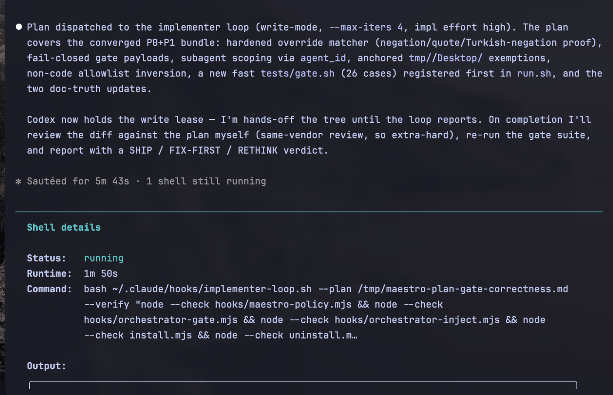
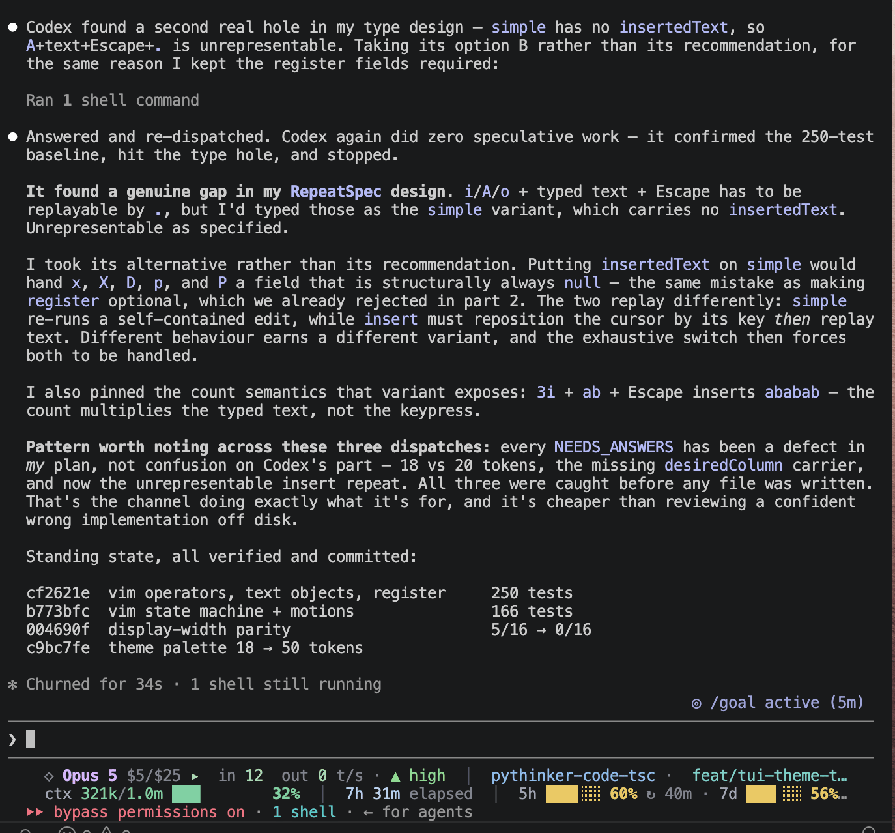

<div align="center">

# 🎼 Maestro

### **Claude is the master. Codex is the hands.**

*An orchestrator/implementer loop for Claude Code — Opus plans, debates, and reviews; Codex writes the code and proves it works.*

[](LICENSE)
[](https://claude.com/claude-code)
[](https://openai.com/codex)
[](hooks/)
[](install.mjs)
[](#requirements)
[](tests/)
[](#requirements)

</div>

---

The orchestrator thinks through *what* and *how* — architecture, plans, reviews, talking to you — but never touches source files. Codex, dispatched through a watchdog, writes the code, runs the verification, and returns a structured result: evidence, or the questions it needs answered.

It runs on your existing **ChatGPT Plus / Codex login**. No OpenAI API key, no proxy, no second subscription.

```bash
git clone https://github.com/Pythoughts-labs/maestro.git
cd maestro && node install.mjs
```

> Restart Claude Code (plain `claude`) afterward so the rules and hooks load.

---

## Maestro in action

Run `node install.mjs`, restart Claude Code in your project terminal, then ask Claude directly to use Codex for the task. That's it — no Maestro skill or slash command is needed.

<div align="center">
  
  
</div>

---

## Why

Some teams trust Claude's judgment more than its patience, and Codex's typing more than its plans. Maestro is for that split: the model you want making decisions (Opus 5 / Fable 5) holds the plan and the final review; the model you want grinding through edits holds the pen.

The loop also fixes what breaks in practice — Codex hanging mid-task, an implementer that guesses when the plan is ambiguous, a review that rubber-stamps its own plan.

## How it works

```
session start → pick Codex model + effort (or keep current)                       ← the setup
your prompt
   → design fork or murky bug? Opus DEBATES Codex (read-only, transcript-carried)  ← the argument
       grill and be grilled, until CONVERGED / ESCALATE / 6-turn cap
   → Opus plans it: objective, files, steps, constraints, verification commands   ← the brain
   → the AUTONOMOUS LOOP runs Codex (write-enabled) until verified:               ← the hands
       dispatch → RESULT → local re-verification → failure evidence re-dispatched
       exits only: VERIFIED_DONE / NEEDS_ANSWERS / BLOCKED / STUCK-at-cap
   → questions relayed back to you, answers re-dispatched                          ← the loop
   → stuck with unclear root cause? the attempts log goes to the debate table
   → Opus reviews the actual diff (SHIP / FIX-FIRST / RETHINK)
   → done
```

### Exit codes

The loop never ends in prose. Every run finishes on a machine-readable state:

| Code | State | What it means | What you do |
|:---:|---|---|---|
| `0` | **VERIFIED_DONE** | Plan executed *and* the verify command passed locally | Review the diff — a claim is not proof |
| `10` | **NEEDS_ANSWERS** | Codex hit real ambiguity and stopped instead of guessing | Answer the `QUESTIONS:` block, re-run |
| `11` | **BLOCKED** | Missing access, a destructive step, or lease contention | Surface it; never improvise around it |
| `12` | **STUCK** | Hit the iteration cap without verification | Read the attempts log, re-plan — don't just raise the cap |

## Components

Installed under `~/.claude`, plus one shared library they source.

| File | Role |
|---|---|
| **`session-start.mjs`** | Opens each session with the Codex model + effort picker. Resumed sessions get a status line instead of a re-ask. |
| **`codex-model-select.sh`** | Pins `model` and reasoning effort in `~/.codex/config.toml` — TOML-safe, backed up, idempotent. Debate and implementation get separate tiers. |
| **`codex-mcp-check.sh`** | Shows exactly which MCP servers your background Codex jobs inherit, env keys masked. |
| **`implementer-loop.sh`** | The autonomous heart: dispatch → parse `RESULT` → re-verify **locally** → feed failure evidence back in. Bounded by `--max-iters`. |
| **`discussion-loop.sh`** | The bidirectional debate channel. Read-only — nobody edits code mid-argument. |
| **`implementer-watchdog.sh`** | Single dispatch with `--write`, cancels a job that stalls for 5 minutes. |
| **`orchestrator-inject.mjs`** | Resets the direct-edit flag per task; states the loop only when the prompt carries a code/design signal. |
| **`orchestrator-gate.mjs`** | Blocks the orchestrator's `Edit`/`Write`/`MultiEdit` on source files. |
| **`lib-companion.sh`** | Shared library: the write lease, provenance detection, companion resolution. |

Plus the behavioral specs: **`orchestrator-implementer.md`** (read every session) and **`coding-discipline.md`** (useful standalone).

## Four design choices that matter

<details>
<summary><b>Grilling is structured, not vibes</b></summary>

Multi-turn debate between models fails in two known ways: endless courteous loops, and one side caving to sound cooperative. A mandatory stance line (`AGREE` / `PUSHBACK` / `ALTERNATIVE` / `REFRAME`) forces Codex to commit each turn; an `AGREE` still has to name the assumption most likely to be wrong; `REFRAME` gives it explicit license to reject the question itself. A 6-turn cap forces every debate to land on `CONVERGED` with stated assumptions, or `ESCALATE` to you with both cases intact.

The output isn't lost either — the converged design, the losing alternatives, and their rejection reasons become the **Decisions** section of the plan, so the implementer sees the debate it wasn't part of.
</details>

<details>
<summary><b>Write access is scoped by contract, reviewed by diff</b></summary>

Codex really edits your tree — that's the point. It may touch only the files the plan names, must report every file it changed, and *nothing it does is believed* until the orchestrator re-reads the actual `git diff` against the stated goal. Fixes never get silently patched by the orchestrator; they go back to Codex so the diff stays single-author.
</details>

<details>
<summary><b>Questions are a first-class channel, not a failure</b></summary>

A background job can't ask interactively, so the contract gives it a structured way to stop instead of guess: `RESULT: NEEDS_ANSWERS` plus a numbered `QUESTIONS:` block. An implementer that guesses is worse than one that asks.
</details>

<details>
<summary><b>The final review is mandatory, and honest about being same-vendor</b></summary>

The orchestrator reviews its own plan's execution. The spec says so out loud and compensates: fresh-eyes diff read, re-run the cheap verification yourself, check for scope creep, open with **SHIP / FIX-FIRST / RETHINK**. If you want a cross-vendor review, pair Maestro with a separate read-only advisor for the review step only.
</details>

## Research

Codex's *built-in* web search is disabled — that was the thing that kept hanging. Its **configured MCP servers (tavily, context7, …) stay available to both loops** for version-sensitive facts.

Research flows plan-first: the orchestrator pre-researches and embeds facts before dispatching, and Codex verifies only what turns out version-sensitive — capped at 2 lookups per run, no retries on stall. Verified facts come back labeled `verified via <mcp>: <fact>`, so the reviewer can trust them over either model's training data.

## Tests

```bash
bash tests/run.sh
```

Six suites covering the write lease and provenance detection. They drive the real entry points end to end — acquiring real leases, mutating real repositories between dispatches — rather than calling helpers directly, because a gate that tests a component instead of the product path can pass while the feature detects nothing.

They are slow on purpose: several suites wait on real lease timeouts.

## Requirements

- **Claude Code** (ships Node), with **Opus 5** (`claude-opus-5`) or **Fable 5** (`claude-fable-5`) as the session model — a `/model` choice, not a config here.
- The **Codex plugin** — `/plugin install codex@openai-codex` inside Claude Code.
- A **ChatGPT Plus / Codex login** — `codex login`. Not an API key.
- *Optional, for `--with-workflow`:* `/plugin install ralph-loop@claude-plugins-official`.

## Install

```bash
git clone https://github.com/Pythoughts-labs/maestro.git
cd maestro
node install.mjs
```

Or hand the repo to Claude Code and say: *"run `node install.mjs` in this repo."*

The installer is idempotent — re-running it changes nothing. It backs up `settings.json`, `config.toml`, and any hook or rule file it would overwrite (`.maestro.bak`), merges its hooks without touching your existing ones, and offers to disable Codex web search.

<details>
<summary><b>Optional: the workflow rule</b></summary>

```bash
node install.mjs --with-workflow
```

Adds `workflow.md` plus the `ralph-protocol` skill it defers to: a bounded execution loop on top of the orchestration loop. Plans live in `tasks/todo.md`, a verifier hierarchy decides what counts as proof, and long jobs run through `/ralph-loop` capped at 8 iterations with an explicit stop line. The Ralph loop drives the *orchestration*; the implementer inside it is still Codex.
</details>

## Uninstall

```bash
node uninstall.mjs
```

Removes the hooks, strips only its own entries from `settings.json`, and leaves your backups in place. A rule is deleted only while it's still byte-identical to this repo's copy — edit one and the uninstaller keeps it and tells you.

## Limits

Stated plainly, because a tool that overstates its guarantees is worse than one that has fewer.

- **The gate is a guardrail, not a boundary.** It is registered for `Edit|Write|MultiEdit` only. `Bash`, MCP tools, and `Workflow`/`Agent` are *not* matched, so a redirect or `sed -i` reaches the tree untouched. Unknown file types are gated by default through a non-code allowlist, the hook fails closed on malformed payloads, and subagents never inherit "edit it yourself". The orchestrator not writing source is a discipline it keeps, not a control that keeps it.
- **Provenance detection reports, it never attributes.** Each write-lease acquisition digests the materialized tree and compares it to the snapshot the previous dispatch left. A mismatch names an interval — never a writer. Ignored paths are out of observation scope on cost grounds, and the log lives inside the repository it watches. It catches accidental convention failures and unnoticed agent writes. It is not an adversarial control.
- **Same-vendor review.** The orchestrator reviews its own plan's execution.
- **Model pin depends on config being honored.** If your companion version overrides the model with its own flags, the pin won't take — check `codex-model-select.sh --show` against one dispatch's behavior.
- **Plugin flag drift.** The watchdog passes `--write` to the companion's `task` subcommand. If your plugin version renamed it, that's one variable at the top of the script.
- **Windows.** The watchdog is a bash script — run Claude Code from Git Bash or WSL.
- **Codex on Plus.** The implementer model is whatever your ChatGPT plan's Codex can reach.

## License

MIT. See [LICENSE](LICENSE). © elkaix / Pythoughts Labs.
